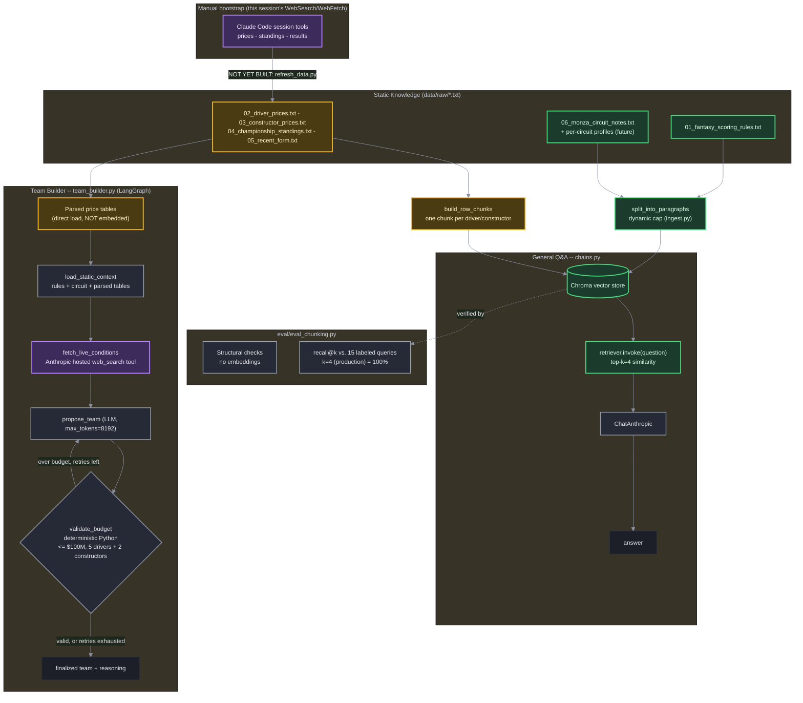

# f1-fantasy -- Architecture

Living doc. Update this alongside the code as the design evolves -- see Changelog at the bottom.

## Diagram

**Important distinction the diagram makes explicit**: the "Manual bootstrap" box (top) is *this Claude Code session's own* WebSearch/WebFetch tools, used once to write the initial `data/raw/*.txt` files -- those tools only exist inside this coding session and are not available to the standalone repo. `fetch_live_conditions` inside `team_builder.py`, by contrast, uses **Anthropic's own hosted `web_search` server tool** (via the raw `anthropic` SDK, `tools=[{"type": "web_search_20250305", ...}]`) -- that's the only live-data path that actually works when you run this repo's code yourself, independent of any Claude Code session.

## Legend

| Color | Meaning | Refresh cadence |
|---|---|---|
| 🟣 Purple | Live tool call (WebSearch/WebFetch), on-demand every query | Real-time, never cached |
| 🟢 Green | Static RAG corpus (vector store, top-k similarity search) | Rare (rules), or weekly (prices re-embedded) |
| 🟡 Amber | Structured data, loaded directly (not vector-searched) | Weekly, via `refresh_data.py` (**not yet built** -- see Known gaps) |
| ⚪ Slate | Orchestration / deterministic logic node | -- |

## Why prices/standings are NOT pure vector RAG

Team-building is a budget-constrained optimization across all 22 drivers + 11 constructors
simultaneously -- a top-k similarity search would only surface a handful of relevant chunks, not the
full price landscape needed to check a $100M budget. So these files are embedded into the vector store
*for the general Q&A chain* (single-fact lookups like "what's Hamilton's price?" work fine with top-k),
but also parsed directly into Python tables for the team-builder graph, which needs the whole table at
once. Same source files, two access patterns, chosen by what the query actually needs.

## Why live weather/incidents are tool calls, not corpus files

They're stale within hours -- baking them into the persisted vector store would either pollute it with
short-lived data or require re-ingesting before every single query. `fetch_live_conditions` calls
WebSearch on-demand instead, and its result is used transiently for that turn only.

## Why validate_budget is deterministic Python, not another LLM call

LLMs are unreliable at exact arithmetic over many line items. The retry loop
(`propose_team -> validate_budget -> propose_team`) mirrors the `grade -> retry` pattern from the
`rag-demo` sibling project, but here it enforces a hard numeric constraint instead of a relevance
judgment -- arguably a more justified use of the pattern.

## Why chunking is paragraph-level, not sentence-level or fixed-size

`RecursiveCharacterTextSplitter` at a fixed `chunk_size` was tried and rejected: it *merges* adjacent
short splits back together, so no single size worked across files whose natural paragraphs are
different lengths (short labeled rule sections vs. longer prose). Splitting further, to individual
sentences, was tested empirically and made things measurably worse: recall@4 on the eval set dropped
from 100% (paragraph-level) to 53% (sentence-level), because several sentences in this corpus depend on
a heading or neighboring bullet for their meaning (e.g. "Sprint DNF: -10..." only reads as
sprint-specific alongside its "SPRINT RACE POINTS" heading -- split apart, it becomes indistinguishable
from the generic race-DNF penalty). The rule that held up under testing: chunk at the boundary where a
fact stops being self-contained -- the paragraph for prose, the single line for the flat price tables
(where each line already has no shared context to lose).

## Chunking strategy reference (exact sizes, as of last ingest)

| Parameter | Value | Where it comes from |
|---|---|---|
| Prose chunking method | Split on `\n\n` (paragraph boundary), no merging | `split_into_paragraphs()` in `ingest.py` |
| Fallback splitter (rare) | `RecursiveCharacterTextSplitter`, only for a paragraph that individually exceeds the cap | `ingest.py` |
| Dynamic paragraph cap margin | 1.25x the longest real paragraph | `PARAGRAPH_MAX_LEN_MARGIN` |
| Dynamic paragraph cap floor | 600 chars minimum, regardless of corpus | `PARAGRAPH_MAX_LEN_FLOOR` |
| **Current computed cap** | **1162 chars** (930-char longest paragraph x 1.25) | `determine_paragraph_max_len()`, re-derived on every `ingest.py` run |
| Row-chunk files | `02_driver_prices.txt`, `03_constructor_prices.txt` -- one chunk per line, not paragraph-split at all | `ROW_CHUNK_FILES` in `ingest.py` |
| Prose chunks produced | 26 (from 4 files: `01`, `04`, `05`, `06`) | min=89, max=930, mean=349 chars |
| Row chunks produced | 33 (22 drivers + 11 constructors) | min=46, max=72 chars |
| Embedding model | `BAAI/bge-large-en-v1.5`, 1024-dim, local, retrieval-tuned | `EMBEDDING_MODEL` in `ingest.py` |
| Vector store | Chroma, cosine similarity, persisted to `./chroma_db/` | `ingest.py` |
| Production retrieval `k` | 4 (used by `chains.py`'s default) | `PRODUCTION_K` in `eval_chunking.py` |

This cap is **derived, not hand-picked** -- rerun `python src/ingest.py` after adding new corpus files and
these numbers (especially the computed cap) will change automatically if a longer paragraph appears.
Don't hardcode these values elsewhere; read them from the source if you need them programmatically.

## Embedding model reference

| Parameter | Value |
|---|---|
| Model | `BAAI/bge-large-en-v1.5` |
| Dimensions | 1024 |
| Type | Retrieval-tuned, asymmetric (query-to-passage) |
| Distance metric | Cosine, declared explicitly (`collection_metadata={"hnsw:space": "cosine"}`) |
| Query instruction prefix | None -- BGE's own docs say v1.5 doesn't need one (older BGE versions did) |

Why this specific model, why cosine, and the full 3-model comparison that drove the choice: see
**[EVALS.md](EVALS.md)**. Switching embedding models requires a full `ingest.py` re-run -- vectors from
different models aren't compatible with each other, and the Chroma collection is deleted and rebuilt from
scratch each ingest (see Changelog: this wasn't always true, and re-ingesting used to silently duplicate
the corpus on top of itself).

## Evals

Moved to its own page: **[EVALS.md](EVALS.md)** -- every eval script under `eval/`, what each checks,
current pass/fail numbers, and (more importantly) the concrete design decisions each one actually drove:
why paragraph-boundary chunking beat 8 other strategies, why `bge-large-en-v1.5` beat two other embedding
models, why cosine distance is now declared explicitly, how the similarity-score threshold and quality
gate numbers were picked from real measured data, and why cross-encoder reranking was tested and
deliberately NOT added.

## Known gaps (honest as of last update)

- **`refresh_data.py` does not exist yet.** `data/raw/*.txt` was populated once via this session's own
  WebSearch/WebFetch tools; there is no automated weekly refresh. Updating prices/standings/form before
  a future race weekend currently means manually re-running that research and rewriting the files.
- **The Zandvoort-derived prompt fix has been validated once, not twice.** Weighting recent hot-streak
  form was added to `PROPOSAL_INSTRUCTIONS` based on the Zandvoort backtest. The Italian GP prediction was
  since scored against the real Monza result and produced two further learnings (penalty-recalculation,
  hot-streak-vs-track-fit -- see `learnings/learnings.json` #2/#3), so the fix has now been exercised
  against two real races, not one -- but a third, independent confirmation (e.g. scoring the Spanish GP
  prediction in `predictions/2026-09-13_spanish_gp.json` once that race happens) is still the fastest way
  to check it generalizes rather than just patches the cases seen so far. The Spanish GP is also the
  system's first prediction at a circuit with zero historical race data of any kind, which is a new kind
  of uncertainty the backtest methodology hasn't had to account for before.
- **No hardening against indirect prompt injection via live web search.** `fetch_live_conditions`
  concatenates live web content directly into the `propose_team` prompt with no sanitization. The
  sibling project `rag-demo` has a dedicated red-team harness for exactly this class of risk in
  retrieved content; this project has not been threat-modeled at all yet. Lower stakes here (personal
  tool, not production), but a real gap, not an oversight to hide.
- **No error handling** if `fetch_live_conditions`'s web search call fails (network error, rate limit,
  empty result) -- an exception there currently crashes the whole graph rather than degrading gracefully.
- **Langfuse is wired but not key-verified.** `src/observability.py`'s Langfuse integration (callbacks,
  session correlation) has been tested against the no-keys fallback path (graceful no-op) but never
  against a real captured trace -- `LANGFUSE_PUBLIC_KEY`/`LANGFUSE_SECRET_KEY` were never actually added
  to `.env`. LangSmith, by contrast, has been verified with real traces via the API.
- **The embedding-space visualization artifact has a broken hover tooltip.** Confirmed via a real browser
  check (screenshot + hover attempts) that the chart itself renders correctly, but hovering a point never
  shows its tooltip. Not yet root-caused -- the artifact runs in a cross-origin sandboxed iframe, which
  blocks direct DOM introspection from outside it, so this needs debugging from inside the artifact's own
  script rather than externally.

## Changelog

- **2026-09-05** -- Initial architecture: static RAG (rules + circuit profiles) vs. structured
  direct-load (prices/standings/form) vs. live tool calls (weather/incidents), wired into a
  `load_static_context -> fetch_live_conditions -> propose_team -> validate_budget` LangGraph loop for
  the team-builder, plus a plain `chains.py` Q&A path reusing the same vector store.
- **2026-09-05** -- Reworked prose chunking from fixed-size `RecursiveCharacterTextSplitter` to
  paragraph-boundary splitting with a corpus-derived dynamic cap (`determine_paragraph_max_len`), added
  row-level chunking for the two price files, and built `eval/eval_chunking.py` (structural checks +
  recall@k against 15 labeled queries) -- verified recall@4 = 100%, and empirically confirmed
  sentence-level splitting performs worse (53%) rather than assuming it.
- **2026-09-05** -- First real end-to-end run of `team_builder.py` surfaced a genuine bug: the
  `propose_team` LLM call was hitting `stop_reason="max_tokens"` with its entire token budget consumed
  by extended thinking, producing a completely empty response (0 drivers/constructors parsed on every
  retry). Fixed by raising `max_tokens` from 2048 to 8192. Confirmed working after the fix: produced a
  valid, under-budget (\$99.7M/\$100M) team for the Italian GP, correctly incorporating a real live detail
  (a driver's grid penalty) surfaced by `fetch_live_conditions` into its reasoning.
- **2026-09-05** -- Built the remaining eval layers: `eval_team_builder_logic.py` (19/19 unit checks on
  parsing/budget math), `eval_generation.py` (10/10, needed an LLM judge for one check after three
  straight substring/regex heuristics produced false negatives), and `eval_prediction_backtest.py` (a
  held-out backtest against the real Zandvoort result -- 5/6 top-6 overlap, wrong winner, which directly
  motivated a hot-streak-weighting fix to `PROPOSAL_INSTRUCTIONS`). Added `predictions_tracker.py` and
  `predictions/` to turn that one-off backtest into an ongoing, repeatable practice across future races.
  Generated 4 strategically distinct team formations for the Italian GP (Safe, Value, Winnability-
  optimized, Aggressive) and saved them to `predictions/2026-09-06_italian_gp.json`, pending scoring once
  the race happens.
- **2026-09-07** -- Scored the real Italian GP result. Found and fixed a real bug while inspecting the
  vector store directly: `Chroma.from_documents()` adds to an existing collection rather than replacing
  it, so every prior `ingest.py` re-run had silently duplicated the corpus on top of what was already
  there -- 167 vectors stored for what should have been 59, 108 of them still carrying the pre-rename
  `f1-fantasy-rag` path. Fixed by deleting the collection before rebuilding; verified idempotent across
  repeated re-ingests.
- **2026-09-07** -- Empirically bench-marked the embedding model choice (see "Embedding model reference"
  above): `all-MiniLM-L6-v2` (original, 60% recall@1) -> `all-mpnet-base-v2` (80%) -> `BAAI/bge-large-en-v1.5`
  (93%, current). Also added LangSmith tracing (`.claude/skills/langsmith-trace`, verified with real
  captured traces) and wired (but not yet key-verified) Langfuse side by side via `src/observability.py`
  for direct tool comparison. Upgraded the project's Python from 3.9 to 3.12 to support both LangGraph
  Studio and Langfuse's 3.10+ requirement; consolidated to a single `venv/` (previously a separate
  `venv-studio/`).
- **2026-09-07** -- Added session_id correlation so a LangSmith trace and a Langfuse trace for the same
  call can be cross-referenced (`propagate_attributes(session_id=...)` on the Langfuse side,
  `metadata.session_id` on the LangSmith side -- verified against the actual installed package, not just
  docs, since LangSmith has no native "session" field of its own). `run_team_builder_full` also now pins a
  `run_id` up front so the exact LangSmith trace URL is known before the call finishes, useful with
  concurrent runs. Verified end-to-end via the no-Langfuse-keys fallback path (graceful no-op). **Langfuse
  itself is still not key-verified** -- real keys were never added to `.env`, so the Langfuse side of this
  correlation is wired and tested for the no-op case only, not confirmed against a real captured trace.
- **2026-09-07** -- Retrieval-layer hardening, each piece tested before adopting (full detail in
  [EVALS.md](EVALS.md)): declared the distance metric explicitly (cosine, tested against l2/ip -- identical
  results confirmed, but no longer an undeclared accident of the current embedding model's normalization);
  added a similarity-score threshold + deterministic quality gate to `chains.py` (skips the LLM call
  entirely for clearly off-topic questions, picked from real measured score distributions, not a guess);
  tested cross-encoder reranking and explicitly did NOT adopt it (net-zero recall@1 change, with evidence
  for why: the general-purpose reranker mishandled a negation the existing bi-encoder got right). Split
  eval documentation out into its own page, `EVALS.md`, since it grew past a summary table.
