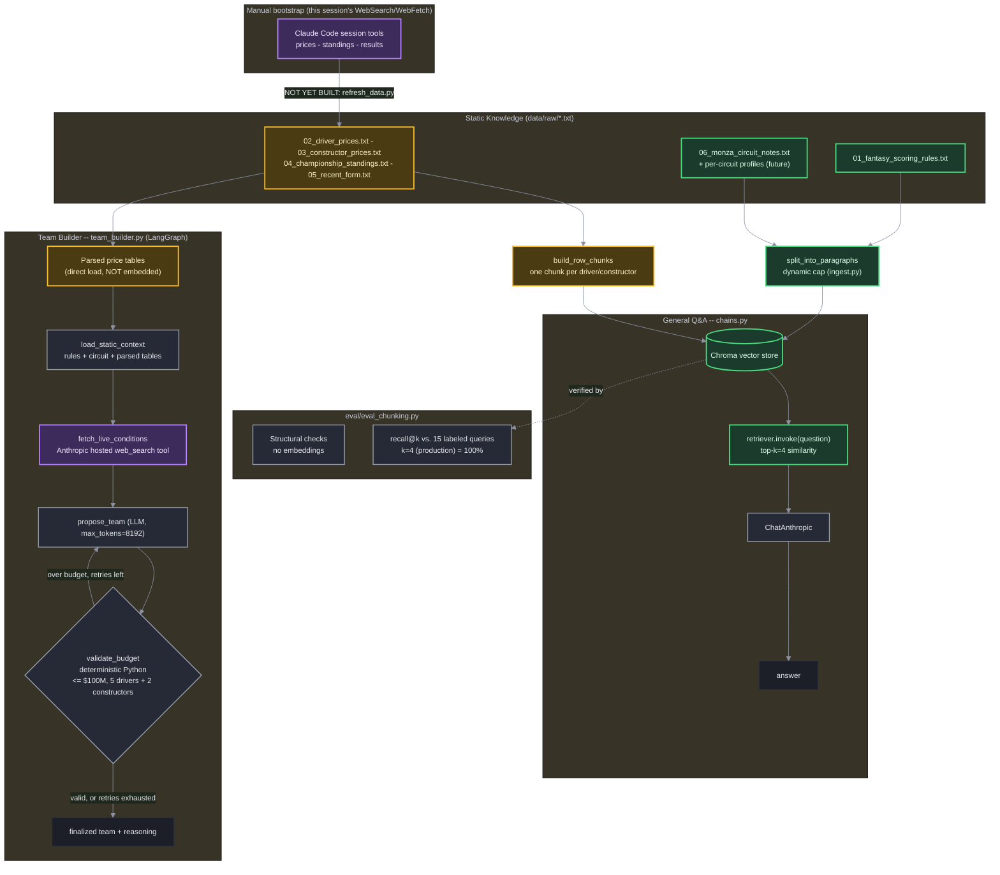

# f1-fantasy-rag -- Architecture

Living doc. Update this alongside the code as the design evolves -- see Changelog at the bottom.

## Diagram

**Important distinction the diagram makes explicit**: the "Manual bootstrap" box (top) is *this Claude Code session's own* WebSearch/WebFetch tools, used once to write the initial `data/raw/*.txt` files -- those tools only exist inside this coding session and are not available to the standalone repo. `fetch_live_conditions` inside `team_builder.py`, by contrast, uses **Anthropic's own hosted `web_search` server tool** (via the raw `anthropic` SDK, `tools=[{"type": "web_search_20250305", ...}]`) -- that's the only live-data path that actually works when you run this repo's code yourself, independent of any Claude Code session.

## Legend

| Color | Meaning | Refresh cadence |
|---|---|---|
| 🟣 Purple | Live tool call (WebSearch/WebFetch), on-demand every query | Real-time, never cached |
| 🟢 Green | Static RAG corpus (vector store, top-k similarity search) | Rare (rules), or weekly (prices re-embedded) |
| 🟡 Amber | Structured data, loaded directly (not vector-searched) | Weekly, via `refresh_data.py` (**not yet built** -- see Known gaps) |
| ⚪ Slate | Orchestration / deterministic logic node | -- |

## Why prices/standings are NOT pure vector RAG

Team-building is a budget-constrained optimization across all 22 drivers + 11 constructors
simultaneously -- a top-k similarity search would only surface a handful of relevant chunks, not the
full price landscape needed to check a $100M budget. So these files are embedded into the vector store
*for the general Q&A chain* (single-fact lookups like "what's Hamilton's price?" work fine with top-k),
but also parsed directly into Python tables for the team-builder graph, which needs the whole table at
once. Same source files, two access patterns, chosen by what the query actually needs.

## Why live weather/incidents are tool calls, not corpus files

They're stale within hours -- baking them into the persisted vector store would either pollute it with
short-lived data or require re-ingesting before every single query. `fetch_live_conditions` calls
WebSearch on-demand instead, and its result is used transiently for that turn only.

## Why validate_budget is deterministic Python, not another LLM call

LLMs are unreliable at exact arithmetic over many line items. The retry loop
(`propose_team -> validate_budget -> propose_team`) mirrors the `grade -> retry` pattern from the
`rag-demo` sibling project, but here it enforces a hard numeric constraint instead of a relevance
judgment -- arguably a more justified use of the pattern.

## Why chunking is paragraph-level, not sentence-level or fixed-size

`RecursiveCharacterTextSplitter` at a fixed `chunk_size` was tried and rejected: it *merges* adjacent
short splits back together, so no single size worked across files whose natural paragraphs are
different lengths (short labeled rule sections vs. longer prose). Splitting further, to individual
sentences, was tested empirically and made things measurably worse: recall@4 on the eval set dropped
from 100% (paragraph-level) to 53% (sentence-level), because several sentences in this corpus depend on
a heading or neighboring bullet for their meaning (e.g. "Sprint DNF: -10..." only reads as
sprint-specific alongside its "SPRINT RACE POINTS" heading -- split apart, it becomes indistinguishable
from the generic race-DNF penalty). The rule that held up under testing: chunk at the boundary where a
fact stops being self-contained -- the paragraph for prose, the single line for the flat price tables
(where each line already has no shared context to lose).

## Known gaps (honest as of last update)

- **`refresh_data.py` does not exist yet.** `data/raw/*.txt` was populated once via this session's own
  WebSearch/WebFetch tools; there is no automated weekly refresh. Updating prices/standings/form before
  a future race weekend currently means manually re-running that research and rewriting the files.
- **`04_championship_standings.txt` is incomplete** -- only the top 2 drivers (Antonelli, Russell) were
  confirmed; the rest of the driver order was not found during research and is explicitly flagged as
  missing in the file itself.
- **No generation-quality eval for `chains.py`** -- `eval/eval_chunking.py` only evaluates retrieval
  (does the right chunk come back), not whether the final generated answer is correct. Spot-checked
  manually (a handful of queries), not systematically.
- **No hardening against indirect prompt injection via live web search.** `fetch_live_conditions`
  concatenates live web content directly into the `propose_team` prompt with no sanitization. The
  sibling project `rag-demo` has a dedicated red-team harness for exactly this class of risk in
  retrieved content; this project has not been threat-modeled at all yet. Lower stakes here (personal
  tool, not production), but a real gap, not an oversight to hide.
- **No error handling** if `fetch_live_conditions`'s web search call fails (network error, rate limit,
  empty result) -- an exception there currently crashes the whole graph rather than degrading gracefully.

## Changelog

- **2026-09-05** -- Initial architecture: static RAG (rules + circuit profiles) vs. structured
  direct-load (prices/standings/form) vs. live tool calls (weather/incidents), wired into a
  `load_static_context -> fetch_live_conditions -> propose_team -> validate_budget` LangGraph loop for
  the team-builder, plus a plain `chains.py` Q&A path reusing the same vector store.
- **2026-09-05** -- Reworked prose chunking from fixed-size `RecursiveCharacterTextSplitter` to
  paragraph-boundary splitting with a corpus-derived dynamic cap (`determine_paragraph_max_len`), added
  row-level chunking for the two price files, and built `eval/eval_chunking.py` (structural checks +
  recall@k against 15 labeled queries) -- verified recall@4 = 100%, and empirically confirmed
  sentence-level splitting performs worse (53%) rather than assuming it.
- **2026-09-05** -- First real end-to-end run of `team_builder.py` surfaced a genuine bug: the
  `propose_team` LLM call was hitting `stop_reason="max_tokens"` with its entire token budget consumed
  by extended thinking, producing a completely empty response (0 drivers/constructors parsed on every
  retry). Fixed by raising `max_tokens` from 2048 to 8192. Confirmed working after the fix: produced a
  valid, under-budget (\$99.7M/\$100M) team for the Italian GP, correctly incorporating a real live detail
  (a driver's grid penalty) surfaced by `fetch_live_conditions` into its reasoning.
